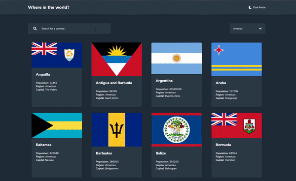

# Job Listings

## Desafio

Desenvolver página para mostrar detalhes geográficos sobre países consumindo uma [API externa](https://restcountries.eu/).

Itens para conclusão do desafio:

- [x] utilizar temas light e dark.
- [x] comunicar com uma API externa.
- [x] busca de países com filtro.
- [x] responsividade.

## Tecnologias usadas

- GatsbyJS
- Styled Components
